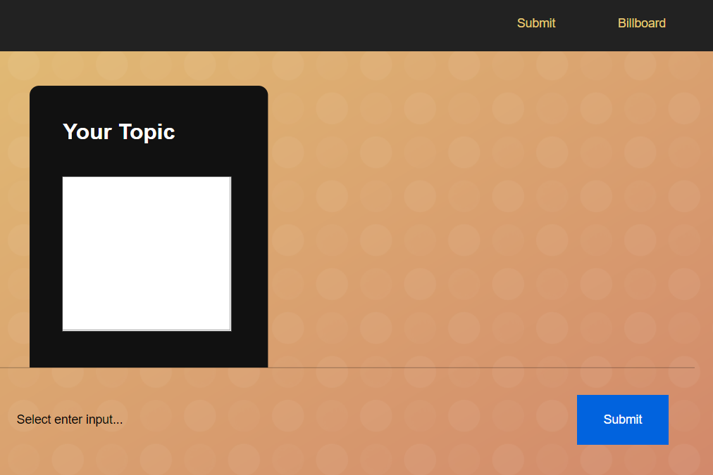
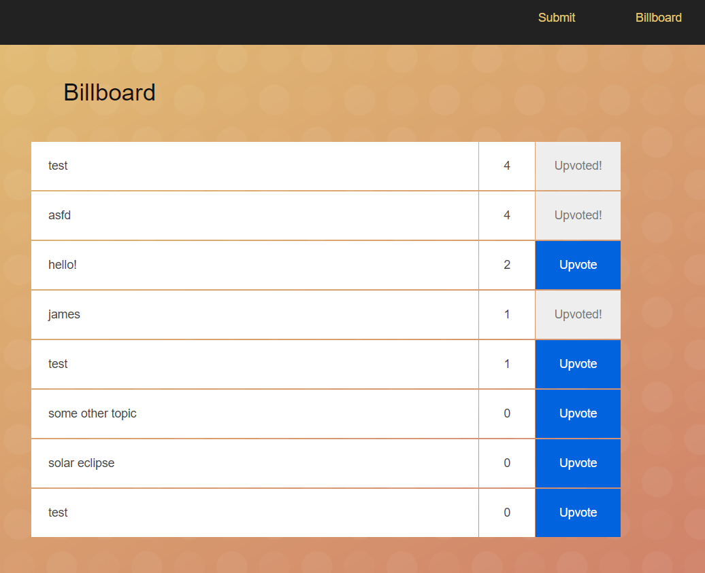

A coffee chat site




## Build
```
npm install
npm start
```

## Deploy

```
az login 
az resource create --name coffeechats-rg --location eastus
az cosmosdb create --name coffeechats --resource-group coffeechats-rg --kind MongoDB
az container create --name coffeechats --image jsturtevant/coffeechats --cpu 1 --memory 1 --ip-address public -g coffeechats-rg -e MONGO_CONNSTRING=<connstringhere>
```
